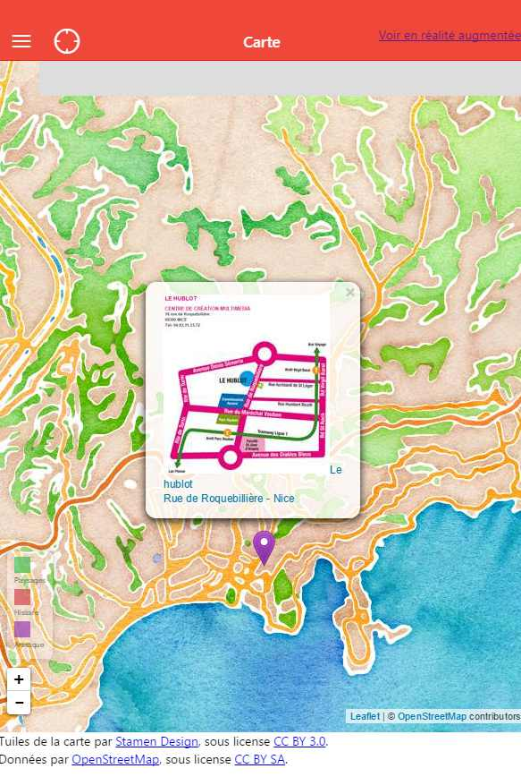
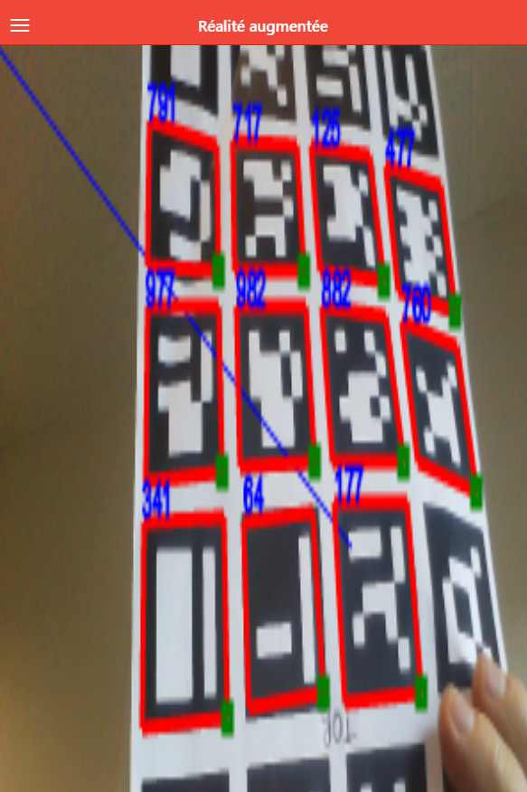
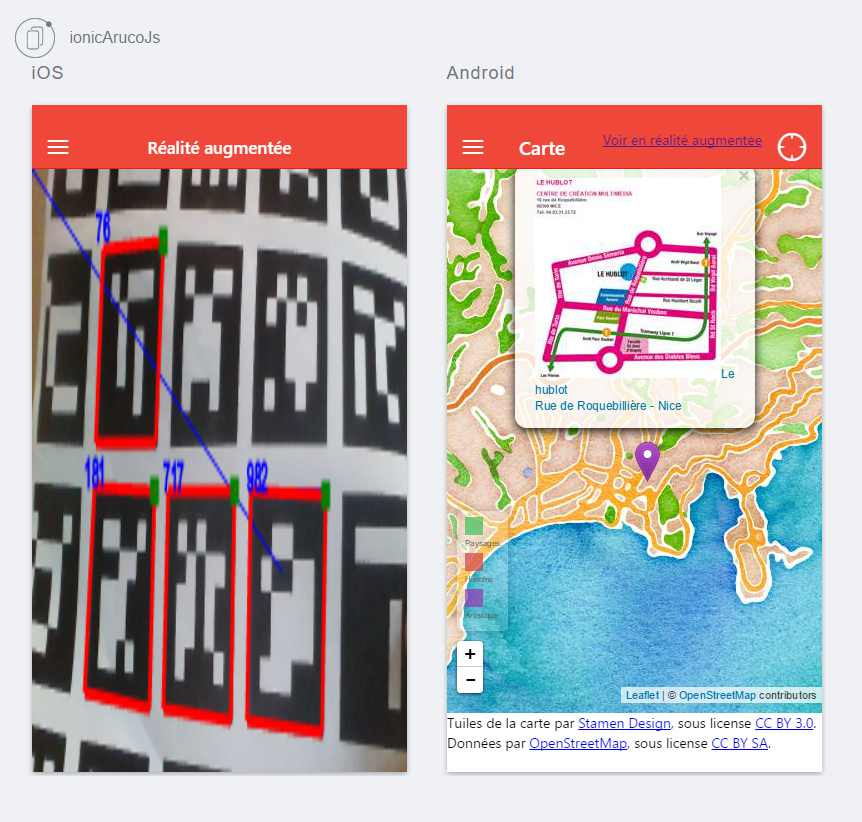

# Art Mobilis - A public space augmented reality artistic route javascript application

##Quick launch 
From the root folder,  execute `ionic serve` into a console.
If you don't how to do a quick launch, read later in the page.

##Project files

- Visual Studio 2013 : Cordova/www/ArtMobilis.sln
- Visual Studio 2015 : Cordova/ArtMobilis2015.sln

##Before you can run or develop

###Windows 7 /8 / 10

Install following software 
- [nodejs](http://nodejs.org)
- [cordova](http://cordova.apache.org)

Install ionic and cordova :

    npm install -g cordova ionic

###Linux

####Install Node.js
See : https://github.com/nodejs/node-v0.x-archive/wiki/Installing-Node.js-via-package-manager

####Install ionic and cordova :

    sudo npm install -g cordova ionic

####Before starting you may need to (manually) link node to nodejs
NOT TESTED : Under debian (and derivative?) install nodejs-legacy , `$ sudo apt-get install nodejs-legacy` in order to have the node binary.

Or use the ugly (but working) link way :

    sudo ln -s /usr/bin/nodejs /usr/bin/node

###Mac OS

Install following software 
- [nodejs](http://nodejs.org) v4.2.1
- [cordova](http://cordova.apache.org)
- Emulator : sudo npm install -g ios-sim
- Devices : sudo npm install -g ios-deploy

Install ionic and cordova :

    sudo npm install -g cordova ionic

Now you can run and dev for ArtMobilis .... let's test if everything is allright

##Check your dev' setup

Check if ionic is well installed

    ionic start ProjectName sidemenu
    
nota: you can test another model : sidemenu , tabs , blank

    cd ProjectName
    
    ionic serve

###ios platform

	ionic platform add ios
	ionic build ios
	ionic run ios

###Android platform

	ionic platform add android
	ionic build android
	ionic run android

###Add Play store platform

	ionic build android --release
	Voir http://developer.android.com/tools/publishing/app-signing.html
	keytool -genkey -v -keystore artmobilis.keystore -alias artmobilis -keyalg RSA -keysize 2048 -validity 10000
	jarsigner -verbose -sigalg SHA1withRSA -digestalg SHA1 -keystore artmobilis.keystore artmobilis-unaligned.apk artmobilis
	jarsigner -verify -verbose -certs artmobilis-unaligned.apk
	// zipalign dans C:\Program Files (x86)\Android\android-sdk\build-tools\23.0.1
	zipalign -v 4 artmobilis-unaligned.apk artmobilis.apk
